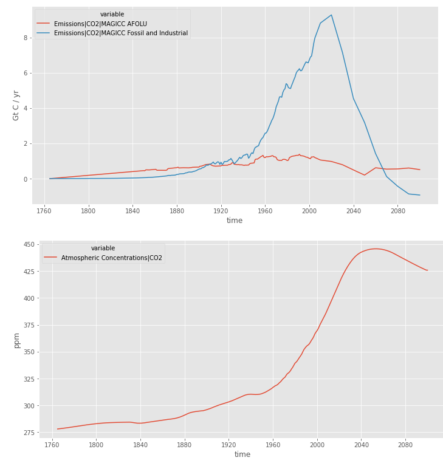
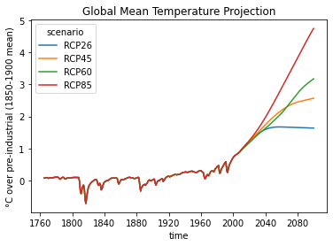
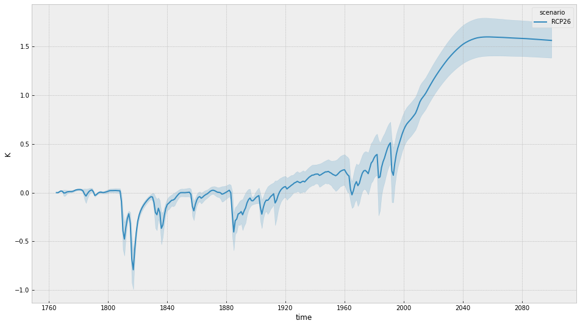

# CMSC6950 - Course Project - Spring 2021
## Pymagicc: A Python wrapper for the simple climate model MAGICC

Ehsan Rafiei Azad

Pymagicc is a Python wrapper around the reduced complexity climate model MAGICC6. It wraps the CC-BY-NC-SA licensed MAGICC6 binary. Pymagicc itself is AGPL licensed.

MAGICC (Model for the Assessment of Greenhouse Gas Induced Climate Change) is widely used in the assessment of future emissions pathways in climate policy analyses, e.g. in the Fifth Assessment Report of the Intergovernmental Panel on Climate Change or to model the physical aspects of climate change in Integrated Assessment Models (IAMs).

Pymagicc makes the MAGICC model easily installable and usable from Python and allows for the easy modification of all MAGICC model parameters and emissions scenarios directly from Python. In climate research it can, for example, be used in the analysis of mitigation scenarios, in Integrated Assessment Models, complex climate model emulation, and uncertainty analyses, as well as in climate science education and communication.

## Setup
```
conda install -c conda-forge pymagicc
conda install matplotlib pandas seaborn notebook pymagicc
conda activate pymagicc_pro
```
On Linux and OS X the original compiled Windows binary available on http://www.magicc.org/ and included in Pymagicc can run using Wine.
## Wine Installation
```
sudo dpkg --add-architecture i386
sudo apt-get install wine32
sudo apt-get install wine
```
## Usage
Clone the repo and the change the directory to the project
```
git clone https://github.com/Ehsan-raf/CMSC6950_Project.git
cd CMSC6950_Project.git
```
Generate the repot
```
make
```
Clean the files
```
make clean
make deepclean
```

## Resuts

**Task1** - Concentration to emissions hybrid



**Task2** - Global Mean Temperature Projection



**Task3** - Filtering and plotting

 
